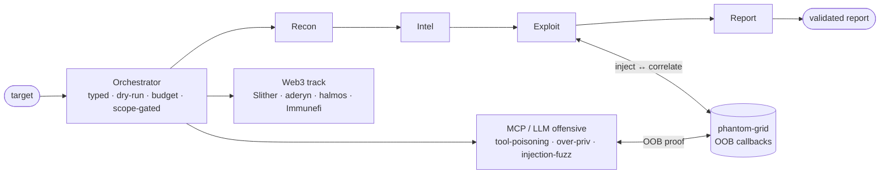

<div align="center">


# 🤖 CyberAI

**OOB-driven, agent-trust-aware AI pentest platform**

> Built by someone who red-teams AI, not just with it.

</div>

---

## What is CyberAI?

CyberAI is a multi-agent orchestration layer for offensive security. Five
specialized agents — **Recon, Intel, Exploit, Report, Web3** — run a typed,
auditable pipeline that turns a target into actionable attack paths and a
validated report.

Two things set it apart from "LLM wrapper over nmap":

- **OOB-driven exploitation.** Blind vulns (SSRF, XXE, blind injection) are
  confirmed through out-of-band callbacks captured by
  [phantom-grid](https://github.com/evkir/phantom-grid), not guessed from
  response diffs.
- **Agent-trust-aware design.** Every banner and tool output is treated as
  untrusted input: sanitized, injection-scanned, and parsed before it ever
  reaches the LLM context. Adversarial thinking is a design input, not a
  disclaimer.

Reach beyond the network: the **Web3 agent** runs Slither static analysis and
maps detectors to Immunefi severity tiers for smart-contract audits.

**In one sentence:** an offensive AI-supply-chain red-team platform — it attacks
MCP servers and LLM/RAG endpoints, proves blind vulnerabilities out-of-band,
audits Web3 contracts on-chain, and publishes reproducible benchmarks, with a
fully air-gapped path on local models (Ollama/vLLM).

Real orchestrator output (trust-aware pipeline in action):

```text
⚠ injection signals in recon output (risk=25)
[ExploitAgent] Generating OOB payloads...
[ExploitAgent] Polling phantom-grid...
[exploit] OOB callbacks: 1
```


## Quick Start

```bash
pip install cyberai

# dry-run: full pipeline, no real network calls
cyberai scan example.com --dry-run

# real scan with a local model (air-gapped, no cloud) and scope
cyberai scan app.target.com --provider ollama --scope "*.target.com"

cyberai status          # config and tool availability
cyberai replay <id>     # re-run a saved session
```

**Trust-aware in one sentence:** if Nmap reads a malicious SSH banner crafted to
hijack the LLM context, the orchestrator neutralizes that vector *before* the data
ever reaches the model.


---

## Architecture


<details><summary>Diagram source (Mermaid, rendered on GitHub)</summary>



</details>

> **Trust boundary** — injection-scan + banner sanitizer at every phase edge.
> Findings reach **confidence = 1.0 only when confirmed out-of-band** via phantom-grid.

**Observability:** SQLite audit log · session export/import · `cyberai replay`
**Interfaces:** CLI · FastAPI dashboard (SSE) · MCP server (Claude Desktop)

### Agents

| Agent | Input | Output | Key tools |
|-------|-------|--------|-----------|
| **Recon** | target | open ports, DNS, WHOIS, subdomains | nmap (flag-whitelisted), async DNS, subdomain enum |
| **Intel** | recon kb | ranked CVEs | NVD client, EPSS enrichment, risk prioritizer |
| **Exploit** | intel kb | attack paths, OOB findings | nuclei, searchsploit, OOB/SSRF/XXE workflows |
| **Report** | session kb | structured Markdown / H1 export | LLM summary + LLM-as-judge validation |
| **Web3** | .sol path / address | severity-tiered findings | Slither, Etherscan, Immunefi classifier |

---

## Security design

- **Agent trust boundaries** — each agent runs with minimal permissions.
- **Untrusted input handling** — banners sanitized, length-capped, marked
  `UNTRUSTED` before LLM context.
- **Prompt-injection detection** — 33-pattern detector at every phase boundary;
  hits become MEDIUM findings, visible in the report.
- **Scope enforcement** — wildcard + `!`-exclusion matching honors HackerOne /
  Bugcrowd briefs (`cyberai scope import`).
- **Audit trail** — every agent action logged (JSONL or SQLite) with full
  inputs/outputs; sessions are replayable.

---

## Quick start

```bash
git clone https://github.com/evkir/CyberAI.git
cd CyberAI
pip install -e .
```

```bash
cp config.example.yml config.yml
cp .env.example .env
# Edit .env — add OPENAI_API_KEY or ANTHROPIC_API_KEY (not needed for --dry-run)
```

```bash
# Dry-run: walks all 4 phases, no network, no API key
python -m cyberai scan example.com --dry-run

# Real scan, scope-restricted
python -m cyberai scan target.htb --scope '*.target.htb'

# Replay a saved session deterministically
python -m cyberai replay <session_id>

# Import a bug-bounty scope
python -m cyberai scope import h1 --program acme

# Status / config
python -m cyberai status
```

### Web dashboard

```bash
uvicorn cyberai.web.app:app --reload
# http://127.0.0.1:8000  — session list, live SSE progress, report view
```

### MCP server (Claude Desktop / Cursor)

```bash
python -m cyberai.mcp.server
```

Exposes recon/intel tools (`nmap_scan`, `dns_enum`, `cve_search`,
`epss_score`, …) plus `mcp_scan` — which lets the server scan *other* MCP
servers — over the Model Context Protocol. See
[docs/mcp/integration.md](docs/mcp/integration.md).

### MCP / LLM offensive red-team

```bash
cyberai mcp-scan http://target.example.com/mcp --report
```

Inventory a target MCP server or LLM endpoint and emit an OWASP-MCP /
MITRE-ATLAS red-team report. See
[docs/redteam/mcp-scanning.md](docs/redteam/mcp-scanning.md).

---

## Configuration

```yaml
# config.yml
llm:
  provider: openai        # openai | anthropic
  model: gpt-4o
  max_tokens: 4096
  temperature: 0.2

phantom:
  grid_url: http://127.0.0.1:9090

output_dir: reports/
max_cost_usd: 0.0         # 0 = disabled; set to enforce a budget
```

### Environment variables

Every setting can be driven from the environment (or a `.env` file - see
[.env.example](.env.example)). Feature flags are off by default
(no-regression); enable any with `1`/`true`/`yes`/`on`.

| Variable | Effect |
|---|---|
| `CYBERAI_LLM_PROVIDER` / `CYBERAI_MODEL` | LLM provider and model |
| `CYBERAI_USE_BEHAVIORAL` | Honeypot/WAF/tarpit fingerprinting in recon |
| `CYBERAI_USE_NUCLEI` | Nuclei template exploit engine |
| `CYBERAI_USE_JUDGE` | LLM-as-Judge report validation |
| `CYBERAI_ENABLE_REPLAN` | Critic-driven phase replan |
| `CYBERAI_USE_EXPLOIT_MEMORY` | Recall similar past exploit chains |
| `CYBERAI_AIR_GAPPED` | Force local-only (no-egress) LLM path |
| `CYBERAI_ENABLE_MODEL_ROUTING` | Per-phase model selection |
| `CYBERAI_MAX_COST_USD` | LLM spend budget (0 = disabled) |
| `CYBERAI_OUTPUT_DIR` | Report output directory |

The `scan` command overrides the main flags per run, in either direction:

```bash
cyberai scan example.com --behavioral --nuclei
cyberai scan example.com --no-air-gapped
```


---

## Benchmarks — honest numbers

CyberAI measures its own engine against a small, self-contained suite of
deliberately-vulnerable targets it authors and serves — no third-party
benchmark required to reproduce the numbers.                                              cyberai bench list

cyberai bench run --suite local --engine real --scorecard reports/scorecard.md                                                                                                      Every published number is **reproducible** (targets ship in `cyberai/bench/apps/`),
**binary** (solved only on an unambiguous success signal from a responding
target — never "looks exploited"), and **traceable** (each run emits a scorecard
with engine version, provider, model, timestamp).

The default `--engine placeholder` reports all-unsolved by design so a scorecard
never overstates capability; `--engine real` runs live per-class probes. External
suites (CVE-Bench, CyBench, EVMBench) plug into the same `BenchTask` contract as
optional adapters for leaderboard parity — never as a product dependency.

See [docs/benchmarks/local-suite.md](docs/benchmarks/local-suite.md) for the
methodology and the current scorecard.

---

## Documentation

| Doc | What |
|-----|------|
| [docs/api/agents.md](docs/api/agents.md) | Agent API reference |
| [docs/exploit/oob-exploitation-workflow.md](docs/exploit/oob-exploitation-workflow.md) | OOB / SSRF walkthrough |
| [docs/web3/web3-audit.md](docs/web3/web3-audit.md) | Smart-contract audit for Immunefi |
| [docs/mcp/integration.md](docs/mcp/integration.md) | MCP server setup |
| [docs/redteam/mcp-scanning.md](docs/redteam/mcp-scanning.md) | MCP/LLM offensive red-team scanning |

---

## Related tools

| Tool | Role |
|------|------|
| [phantom-grid](https://github.com/evkir/phantom-grid) | OOB interaction capture |
| [phantom-intel](https://github.com/evkir/phantom-intel) | CVE intelligence feed |
| [reality-probe](https://github.com/evkir/reality-probe) | TLS analysis & config auditing |

---

## Requirements

- Python 3.11+
- OpenAI **or** Anthropic API key (not required for `--dry-run`)
- Optional: phantom-grid (OOB), nuclei, slither, NVD API key

## ⚠️ Legal / Authorized Use

CyberAI is an offensive-security tool intended **strictly for authorized
security testing, research, and education**. Use it **only** against systems
you own or for which you hold explicit, written permission (e.g. a signed
engagement, an in-scope bug-bounty program, or a lab you control).

- Unauthorized scanning, exploitation, or access of systems is illegal in most
  jurisdictions and is **not** condoned by this project.
- You are solely responsible for ensuring your use complies with all applicable
  laws and with the rules of any target program.
- The software is provided "as is", without warranty of any kind. The authors
  and contributors accept **no liability** for misuse or for any damage arising
  from its use.

By using CyberAI you agree to operate within these bounds.

---


---

## License

MIT — see [LICENSE](LICENSE)

<div align="center">
<sub>Part of the <a href="https://github.com/evkir">evkir</a> security toolchain.</sub>
</div>
